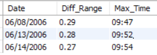

# LINUX_SQL Challenge
## Question 01

### Output:

## Question 02

### Assumptions made:
Transaction trade size = vol  
transaction trade price = close    
I've created a temporary table which will have all values of the original table except date.  
Instead of the original date, I've parsed it into two other columns - ##date_only(dd-mm-yyy) and time_only(hh:mm)  

### Input format:
Date: 'dd-mm-yyyy'  
start_time: 'hh:mm'

### Sample input:
call Vol_Weighted_Avg('11-10-2010','09:00');

### Sample Output

## Question 03:

### Output:

## Have a greaatt day!:smile: