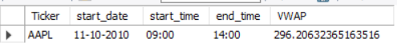
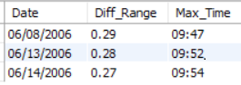
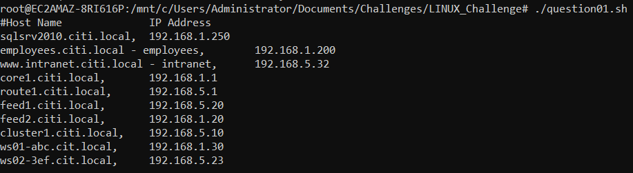
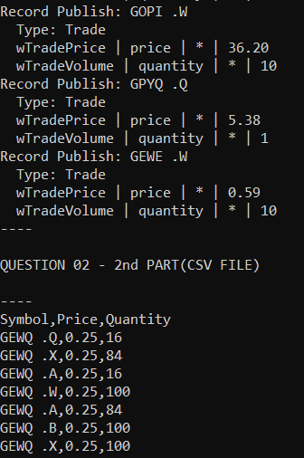
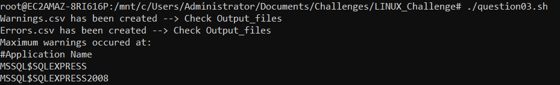

# LINUX_SQL Challenge

## SQL Challenge:
## Question 01

### Output:

## Question 02

### Assumptions made:
Transaction trade size = vol  
transaction trade price = close    
I've created a temporary table which will have all values of the original table except date.  
Instead of the original date, I've parsed it into two other columns - date_only(dd-mm-yyy) and time_only(hh:mm)  

### Input format:
Date: 'dd-mm-yyyy'  
start_time: 'hh:mm'

### Sample input:
call Vol_Weighted_Avg('11-10-2010','09:00');

### Sample Output

## Question 03:

### Output:

## LINUX Challenge:

### Note:
1. Store the input log files under Challenges -> Log_files -> (your files)
2. All the output files are stored in LINUX_Challenge -> Output_files
## Question 01

Host name alias also considerd.  
To run: ./question01.sh 
### Output:

## Question 02

SymPriceQuan.csv file is just for reference and has symbols,price and quantity values without comma separated.  
The output files for this question are "TradePriceVolume.tab" and "SymPriceQuantity.csv"(has comma separated values).  
To run: ./question02.sh  

Scroll up a bit of output to view both the 1st and second part of the output.:relaxed:
### Output:

## Question 03

To run: ./question03.sh 
### Output:

## Have a greaatt day!:smile: