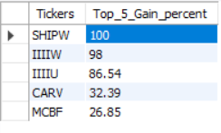
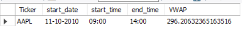

# LINUX_SQL Challenge
## Question 01

### Output:

## Question 02

### Assumptions made:
Transaction trade size = vol
transaction trade price = close

### Input format:
Date: 'dd-mm-yyyy'
start_time: 'hh:mm'

### Sample input:
call Vol_Weighted_Avg('11-10-2010','09:00');

### Sample Output
